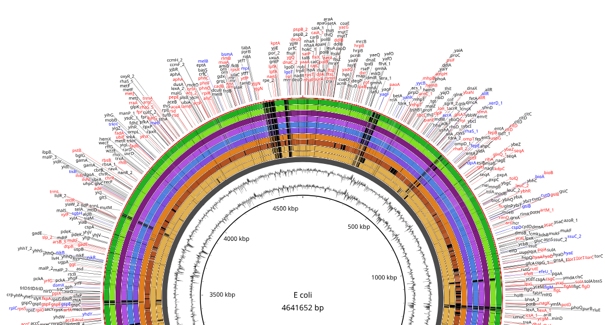

# Academic Portfolio

## Summary
Afsan Sarwer is a Doctor of Veterinary Medicine (DVM) and an MS fellow in Microbiology at Bangladesh Agricultural University. Specializing in bioinformatics and whole genome sequencing (WGS), he applies machine learning and deep learning models to advance research. With leadership experience in the non-profit sector, Afsan excels in team management, organizational strategy, and project execution, bridging scientific innovation with impactful community work.

## Contact Information

- **Email**: [afsansarwer.bd@gmail.com](mailto:afsansarwer.bd@gmail.com)

    
  

---

## Education

| Degree | Institution | Graduation Year |
|--------|-------------|-----------------|
| **Doctor of Veterinary Medicine (DVM)** | Faculty of Veterinary Science, Bangladesh Agricultural University | 2025 |
| **MSc Fellow in Microbiology** | Department of Microbiology and Hygiene, Bangladesh Agricultural University | Currently Enrolled |

---

## Research Interests

- Whole Genome Sequence (WGS)
- Antimicrobial Resistance (AMR)
- Bioinformatics
- Deep Learning for Veterinary Diagnostics
- Microscopic Image Analysis
- Computer Vision in Life Science

---

## Research Experience  

### Ongoing Research Project | Department of Microbiology & Hygiene, BAU  
  **Theme**: Whole-Genome-Based Global Phylogeny and Resistome Profiling (_proposed_)
  **Advisor**: Professor Dr. Tanvir Rahman | [Profile](https://bau.edu.bd/profile/VMH1005)  

 

  

 

  

### Independent Research Project | Bangladesh Agricultural University  
  **Title**: Livestock Endoparasite Detection with Machine Vision and Deep Learning  
  **Advisor**: Professor Dr. A K M Anisur Rahman | [Profile](https://bau.edu.bd/profile/VM1004)  
  **Duration**: August 2024 - December 2024  
  **Key Works**:
  - Utilized YOLOv8 deep learning model for microscopic image processing.
  - Collected and annotated images for training the model to detect livestock endoparasites.
  - Evaluated the model using metrics like accuracy, precision, recall, F1-score, and confusion matrix.

  

  

---

## Additional Experience

- **Intern Student**: 21st DVM Internship Program 2024  
                      Faculty of Veterinary Science, Bangladesh Agricultural University  
                      (Sept 2024 - Feb 2025)
  
- **Student Member**: Veterinary Information Network (VIN)  
                      (June 2020 - March 2025)
  
- **Global Outreach - Student Membership**: American Society for MicrobiologyAmerican Society for Microbiology  
                      (Jan 2025 - Present)
  
- **Joint Organizing Secretary**: Bangladesh Agricultural University Career Club (BAUCC)  
                      (Dec 2021 - March 2023)
  
- **Founding Member**: Team Utshob  
                      Cultural Innovation and Collaboration  
                      (Feb 2020 - Present)
  
- **BYLC Graduate**: BYLC Graduate Network  
                      (June 2020 - Present)
  
- **General Secretary**: Connecting Youth for Change (CYC)  
                      (June 2020 - Dec 2022)

---

## Technical Skills

- **Programming**: Linux, Python, LaTeX, Data Analysis (NumPy, Pandas, Matplotlib, Seaborn), TensorFlow for Neural Networks
  
- **Tools**: Linux shell, Google Colab, Jupyter Notebook, Visual Studio Code, SPSS, Github, Excel, PowerPoint, Adobe Illustrator, Adobe Photoshop, Adobe Premiere Pro, Google Forms
  
- **Research**: Isolation and culture of microorganisms, PCR, Antibiogram profiling, AST, Gene detection, WGS data handling, Evolutionary relationship determination, Sequence typing,  Microscopic Observations

---

## Conference Presentations

**23rd SCAC Conference – Fourth Industrial Revolution and Future Society**  

**Location**: National Science & Technology Complex, Dhaka, December 2024  

**Poster Title**: _Livestock Endoparasite Detection with Machine Vision and Deep Learning_  

**Authors**: Afsan Sarwer, Md Fahim Shahria  

**Presentation Type**: Poster  

---

## Highlighted Certifications  

- **Bangladesh Veterinary Council (BVC)**: Registered Veterinarian, Reg No. 9700

- **IBM (through Coursera)**: “Data Analysis with Python”
  
- **Wellcome Connecting Science (through FutureLearn)**: “Bacterial Genomes: From DNA to Protein Function using Bioinformatics”
  
- **Bangladesh Youth Leadership Center (BYLC)**: “CareerX 18”
